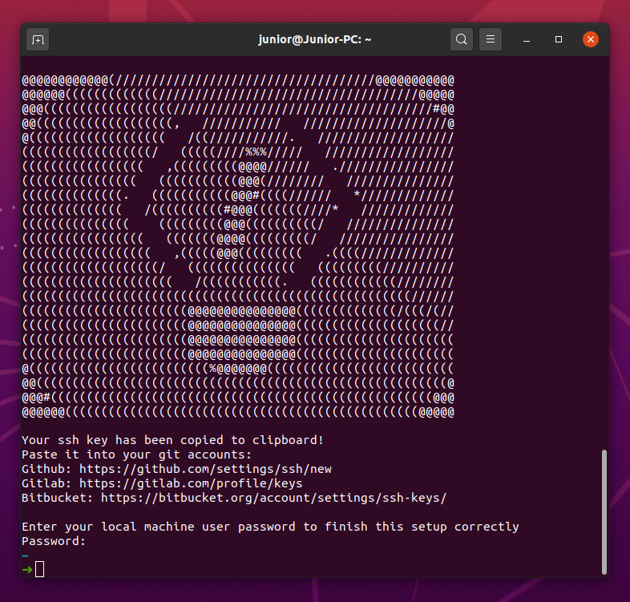

# ubuntu-inovando
Custom Ubuntu Desktop ISO Image &amp; bash script with pre-installed/configured apps for a modern web development environment



## Setup
```bash
wget https://github.com/inovando/ubuntu-inovando/blob/master/setup.sh
chmod +x setup.sh
bash setup.sh
# after this command, reboot your system :)
```